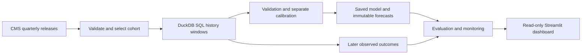

# Healthcare Workforce Staffing Forecasting System

An independent portfolio project that helps a workforce planning analyst review **the next seven days of contract RN, LPN and CNA hours** at nursing homes. It combines forecasts, uncertainty intervals, data-quality checks and a dashboard for investigating results.


| Evidence | Verified result |
| --- | --- |
| Data | CMS Payroll Based Journal; **50 New York nursing homes**, April 2024–March 2026 (eight quarters) |
| Forecast | Total reported contract RN + LPN + CNA hours per facility over **T+1 through T+7** |
| Selected model | **Preceding-seven-day baseline**, selected by chronological validation MAE |
| Held-out evaluation | **8,660 evaluable facility-origins**, October 1, 2025–March 24, 2026 |
| Error | **39.59 hours MAE · 7.29% WAPE** |
| Uncertainty | **86.22% empirical coverage** for nominal 90% intervals; mean width 398.03 hours |

This is a **historical replay** using quarterly public releases. Daily feed availability is an assumption. Forecasted utilization does not establish unmet demand, adequate clinical staffing or financial savings. Daily forecast windows overlap; the observations are not independent samples.

**Start here:** [three-minute demonstration](docs/DEMO_SCRIPT.md) · [executive brief](artifacts/full/reports/EXECUTIVE_BRIEF.md) · [technical evaluation](artifacts/full/reports/BACKTEST.md) · [verification record](VERIFICATION.md)

## What this demonstrates

- **Python and SQL:** an installable package, DuckDB calendar windows, Parquet artifacts and a Streamlit dashboard.
- **Data validation:** source checksums, schema and staffing-role checks, training-only cohort selection, and explicit missing-versus-zero handling.
- **Chronological evaluation:** expanding validation, complete labels at fit cutoffs, separate interval calibration and a held-out final test.
- **Uncertainty and monitoring:** empirical coverage, facility-level failures, immutable forecasts, later outcome attachment, and alerts for completeness, freshness, failed jobs, drift and realized errors.
- **Stakeholder communication:** an executive brief, an interactive walkthrough and candid interpretation of model limitations.

## How it works



See the [architecture](docs/ARCHITECTURE.md), [data dictionary](docs/DATA_DICTIONARY.md) and [model card](docs/MODEL_CARD.md) for the implementation details.

## Model comparison and selection

| Approach | Validation MAE (h) | Test MAE (h) | Test WAPE | Test interval coverage |
| --- | ---: | ---: | ---: | ---: |
| **Preceding 7 days — selected** | **40.88** | **39.59** | **7.29%** | **86.22%** |
| Trailing 28-day mean × 7 | 41.38 | 40.69 | 7.49% | 86.45% |
| Best tuned histogram gradient boosting | 42.70 | 39.91 | 7.35% | 84.19% |

The baseline won the prespecified validation criterion against both another baseline and four gradient-boosting candidates. Retaining it follows the evidence and gives an interpretable forecast: repeat the preceding week's utilization. The small test difference does not establish statistically significant superiority. The test was excluded from tuning, model selection and calibration.

Intervals **undercovered** their nominal 90% target, especially in the medium-volume group (74.54%). Abrupt zero-to-positive changes produced severe misses. These findings are retained without post-test recalibration. WAPE is an error ratio, not an accuracy percentage. [Full results, volume groups and failure examples →](artifacts/full/reports/BACKTEST.md)

## Quick start — no download or training required

Install **Python 3.12** and Git. Clone this repository, then run the commands for your shell. The pinned dependency set requires Python 3.12.

```bash
git clone https://github.com/yashvekhande-analyst/healthcare-workforce-forecasting.git
cd healthcare-workforce-forecasting
```

**macOS / Linux**

```bash
python3.12 -m venv .venv
source .venv/bin/activate
python -m pip install -r requirements.lock
python -m pip install --no-build-isolation --no-deps .
python -m streamlit run app.py
```

**Windows PowerShell**

```powershell
py -3.12 -m venv .venv
.\.venv\Scripts\python.exe -m pip install -r requirements.lock
.\.venv\Scripts\python.exe -m pip install --no-build-isolation --no-deps .
.\.venv\Scripts\python.exe -m streamlit run app.py
```

Open the local address printed by Streamlit. The bundled real artifacts cover the **full analysis cohort**, not a smaller showcase sample. No credentials, cloud account, raw downloads or training are needed. `Launch.ps1` also starts an existing project environment on Windows. There is no public hosted app; [screenshots and the walkthrough](docs/DEMO_SCRIPT.md) provide a preview.

With the environment active (Windows: `.\.venv\Scripts\Activate.ps1`), verify the bundle and run the tests:

```bash
python scripts/verify_publication.py
python -m pytest -q -p no:cacheprovider
```

## Full reproduction

The repository includes processed daily data, features, the saved model, complete test forecasts/outcomes, calibration and validation predictions, and all analytical reports. The approximately **301 MB raw snapshot is excluded**; its source URLs, retrieval timestamps and SHA-256 checksums remain in [the provenance manifest](data/manifest.json). See [bundle contents](docs/DEMO_BUNDLE.md).

Use a fresh experiment directory to preserve the published evidence:

```bash
python scripts/init_reproduction.py --directory reproduction
workforce --config reproduction/configs/full.json fetch
workforce --config reproduction/configs/full.json run
```

`fetch` acquires the requested eight quarters from CMS; `run` prepares, trains, evaluates, issues replay forecasts, attaches matured outcomes and builds monitoring/reports. These commands are separate from the quick start and CI. On Windows without activation, replace `workforce` with `.\.venv\Scripts\workforce.exe`.

CMS may revise or retire releases. A new acquisition can therefore differ from the preserved snapshot; do not silently substitute its results for this release. [Full commands, snapshot restoration and manual CSV fallback →](docs/REPRODUCTION.md)

## Sources, assumptions and status

- **Source:** [CMS Payroll Based Journal Daily Nurse Staffing](https://data.cms.gov/quality-of-care/payroll-based-journal-daily-nurse-staffing). [Provenance and methodology](docs/SOURCES.md) include reporting periods, dictionaries and retrieval details. [Data attribution](DATA_NOTICE.md) applies to CMS data and derived artifacts separately from source code.
- **Availability:** this replay assumes staffing and historical census through the end of T. Quarterly publication, retrospective census derivation and revisions prevent a true historical data-vintage backtest.
- **Scope:** 50 nursing homes in one state; facilities were selected using early training history. Findings do not establish generalization to other facilities, hospitals or staffing decisions.
- **Missingness:** forecasts require 28 complete history days. True reported zeros are preserved. Seven complete future days are required for evaluation; reported performance is conditional on evaluable records.
- **Reliability:** intervals are empirical, undercoverage is measured, and facility bounds cannot be summed into a joint portfolio interval. Monitoring prompts review; it never automatically retrains or deploys.
- **Deployment:** local application and automated checks are verified. The [GCP extension](docs/GCP_DEPLOYMENT.md) adds versioned private storage, typed BigQuery reconciliation, a read-only Cloud Run dashboard, and one bounded replay job. [Cloud verification status](docs/GCP_VERIFICATION.md) distinguishes local tests from executed cloud work; hosted deployment is currently pending billing. [Learning guide](docs/GCP_LEARNING_GUIDE.md) and [resource cleanup](docs/GCP_CLEANUP.md) are included. No production use, employer affiliation, customers or savings are claimed.
