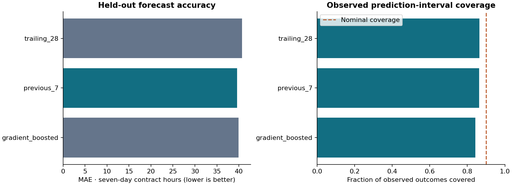

# Backtesting report

## Design fixed before test evaluation

- Initial facility eligibility ends 2024-12-31.
- Expanding validation origins: [['2025-01-01', '2025-03-24'], ['2025-04-01', '2025-06-23']]. Each fit uses only labels ending before the next validation origin.
- Four histogram gradient-boosting candidates: leaf counts 7/15 × L2 1/10, absolute-error loss, 180 iterations, learning rate 0.06. No random early-stopping split. Preprocessing is refit only on each training prefix.
- Final point fit cutoff: **2025-06-30**, 21,009 examples; origins 2024-04-28–2025-06-23.
- Separate calibration: 2025-07-01–2025-09-23, 646 facility-origins, every seventh day. Last calibration label ends 2025-09-30.
- Untouched test origins: **2025-10-01–2026-03-24**, each predicting T+1…T+7. Frozen models are not refitted on calibration or test data.

## Model selection from validation only

| model | n | mae_hours | wape | signed_error_hours |
| --- | --- | --- | --- | --- |
| previous_7 | 8266 | 40.876 | 0.070 | 0.710 |
| trailing_28 | 8266 | 41.376 | 0.071 | 2.596 |
| gb_1 | 8266 | 42.700 | 0.073 | -2.130 |
| gb_0 | 8266 | 42.892 | 0.073 | -2.207 |
| gb_3 | 8266 | 44.124 | 0.075 | -2.761 |
| gb_2 | 8266 | 44.565 | 0.076 | -2.673 |

Selected model: **previous_7** (candidate previous_7). The best gradient candidate was gb_1 with {'max_leaf_nodes': 7, 'l2_regularization': 10.0}. The selected model is retained even if a different method happens to score better on the final test.

## Final test results

| model | n | mae_hours | wape | signed_error_hours | coverage | mean_width_hours |
| --- | --- | --- | --- | --- | --- | --- |
| gradient_boosted | 8660 | 39.912 | 0.073 | -1.334 | 0.842 | 384.719 |
| previous_7 | 8660 | 39.594 | 0.073 | 1.167 | 0.862 | 398.030 |
| trailing_28 | 8660 | 40.691 | 0.075 | 3.509 | 0.865 | 436.540 |

MAE is mean absolute forecast error in seven-day contract hours. WAPE is sum absolute error divided by sum absolute actual hours; a zero denominator yields N/A, even if all predictions are zero. Signed error is prediction minus actual: positive means overprediction. Coverage is the fraction inside inclusive interval endpoints. Width is upper minus lower. Samples are pooled facility-origins; daily origins have overlapping outcome windows, so counts are not independent observations and summed actuals repeat hours across forecasts. These totals must not be interpreted as unique labor volume.

Expected facility-origins: **8,750**; forecastable: **8,667**; evaluable: **8,660**; issued forecasts with unknown outcomes: **7**. Accuracy and coverage are conditional on evaluable data. See `facility_metrics.csv`, `volume_metrics.csv`, and `nonoverlap_test_metrics.csv` for facility, training-volume and weekly-origin sensitivity analyses.

Selected-model performance by initial-training staffing-volume group:

| volume_group | n | mae_hours | wape | coverage | mean_width_hours |
| --- | --- | --- | --- | --- | --- |
| high | 2975 | 80.393 | 0.057 | 0.928 | 1,039.709 |
| low | 2885 | 5.654 | 0.290 | 0.907 | 14.937 |
| medium | 2800 | 31.216 | 0.209 | 0.745 | 110.970 |

Pooled accuracy can conceal much higher relative errors or lower interval coverage in individual volume groups. The groups are descriptive, fixed using training data, and not a basis for post-test model switching.

## Intervals

The 90% interval uses the finite-sample quantile of |actual − prediction| / (1 + preceding-seven-day hours), computed on earlier calibration data separately for each fitted model. Forecast bounds are max(0, prediction − q×scale) and prediction + q×scale. The lower truncation respects the nonnegative outcome. No residuals from the test period enter calibration. Temporal and facility dependence, revised source data, reporting exclusions and distribution changes violate simple exchangeability assumptions; nominal coverage is a target, not a guarantee. Facility intervals are not additive portfolio confidence intervals.

## Representative failures (selected model, final test)

| facility | origin | prediction | actual | lower | upper | absolute_error |
| --- | --- | --- | --- | --- | --- | --- |
| 335291 | 2026-01-01 | 2,755.500 | 3,502.750 | 1,749.478 | 3,761.522 | 747.250 |
| 335291 | 2026-01-02 | 2,807.750 | 3,552.250 | 1,782.659 | 3,832.841 | 744.500 |
| 335133 | 2026-01-25 | 0.000 | 696.560 | 0.000 | 0.365 | 696.560 |
| 335772 | 2025-11-01 | 3,287.250 | 3,966.750 | 2,087.159 | 4,487.341 | 679.500 |
| 335772 | 2025-11-02 | 3,326.750 | 3,996.000 | 2,112.243 | 4,541.257 | 669.250 |
| 335133 | 2026-01-26 | 68.470 | 720.340 | 43.116 | 93.824 | 651.870 |

These are measured large errors, not selected successes. Abrupt shifts in contract use, zero-to-positive transitions and unusual staffing reports can overwhelm recent-history predictors. This dataset cannot identify their operational causes. Use analyst review, inspect recent staffing, and withhold a forecast when its input history is incomplete. The system is unsuitable for clinical staffing adequacy, unmet demand estimation, staffing mandates, cost-saving claims, or decisions at facilities outside the evaluated domain.

For example, facility 335133 at origin 2026-01-25 had zero preceding-seven-day hours but then reported 696.56 hours in the target window; the forecast was 0.00 hours with an upper bound of 0.36. A change from zero history to substantial utilization exposes the interval method's weakness.

All values can be recomputed from immutable `test_forecasts.parquet`, separate `test_outcomes.parquet`, and `evaluation.parquet`. Validation and calibration predictions retain their own split/model identifiers.
