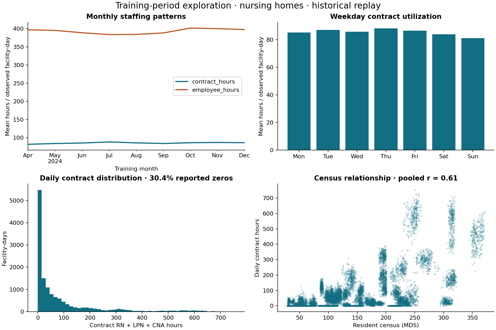
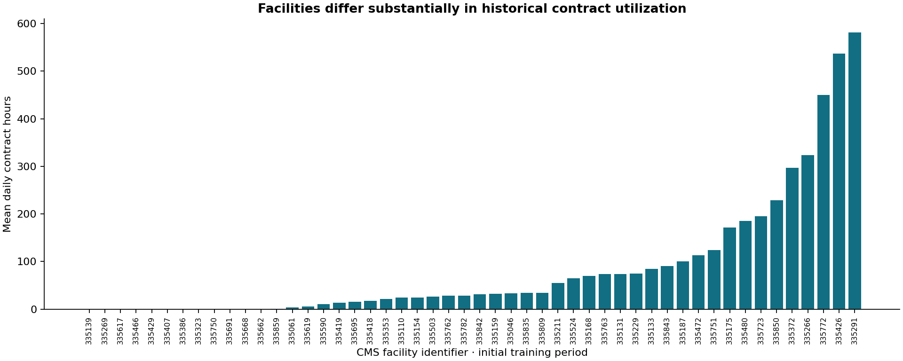

# Exploratory analysis

Independent portfolio project. Nursing-home contract staffing utilization; historical replay.

The EDA used **2024-04-01 through 2024-12-31 only**, before validation, calibration or final testing. The 50 selected NY facilities were sampled by a seeded identifier hash among 591 facilities with at least 95% valid training dates. This is an engineering cohort, not a representative state survey.

Average daily RN/LPN/CNA contract hours were **85.5** versus **393.0 employee hours**. Reported daily contract zeros comprised **30.4%** of valid training days; complete seven-day targets were zero **26.8%** of the time. The 99th percentile was 615.1 hours and the maximum was 754.8 hours. Extreme positive observations were retained and exported for review. No outcome clipping or test-driven exclusions were applied.

The pooled census/contract-hours correlation was **0.609**. Facility size and staffing mix confound this association: it is descriptive, not causal. Historical census is included as context. Future census is unavailable to prediction.

The monthly and weekday plots motivate trailing summaries and calendar features. Only nine training months are available at initial eligibility, so the EDA does not establish repeatable annual seasonality. Full training later expands chronologically. Strong facility differences motivate facility indicators and training-defined volume groups. Zero-heavy behavior motivates absolute-error loss and a strong persistence baseline.

## Data quality and coverage audit (all quarters, descriptive)

There are 433,437 unique state source records and 36,500 expected selected facility-days. Of these, 36,319 are reported, 181 are missing dates, and 0 reported days have invalid contract targets. Validation found 0 negative-hour rows, 0 total/component mismatches, and 0 rows with missing hours among selected facilities. Full calendar coverage by quarter is in `quarter_coverage.csv`; no future coverage was used to replace selected facilities.

Missing observations stay null; reported zeros stay zero. Missing source quarters can reflect CMS inclusion/exclusion criteria, closure, or reporting changes; these data alone cannot distinguish causes. Modeling requires 28 valid contract history days and seven observed outcome days. Missing employee/census predictors use training-only median imputation plus missing indicators. Quarterly schemas are recorded in the manifest; current source column definitions were consistent across the downloaded files.

Sources and interpretation: [CMS dataset](https://data.cms.gov/quality-of-care/payroll-based-journal-daily-nurse-staffing); see `docs/SOURCES.md` and `data/manifest.json`. Source data are quarterly releases, not an operational daily feed. The modeled hours do not establish unmet demand or clinically appropriate staffing.
