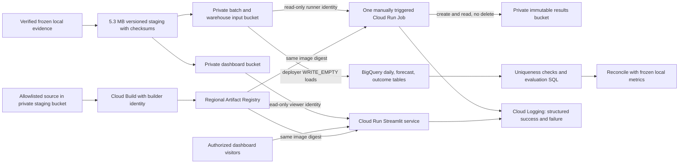

# Architecture

```mermaid
flowchart LR
    CMS[CMS quarterly catalog and PBJ releases] --> RAW[Immutable raw API pages or CSVs]
    RAW --> MAN[Provenance manifest and checksums]
    RAW --> VALID[Schema and value validation]
    VALID --> COHORT[Training-only facility selection]
    COHORT --> SQL[DuckDB calendar grid and SQL windows]
    SQL --> PARQUET[Daily and feature Parquet]
    PARQUET --> CV[Expanding validation and model selection]
    CV --> FIT[Frozen model and earlier interval calibration]
    FIT --> MODEL[Versioned saved model]
    PARQUET --> REPLAY[Prefix-only historical replay]
    MODEL --> REPLAY
    REPLAY --> FORECAST[Immutable forecasts]
    PARQUET --> ACTUAL[Later matured actuals]
    FORECAST --> EVAL[Joined evaluation and reports]
    ACTUAL --> EVAL
    EVAL --> APP[Read-only Streamlit analyst dashboard]
    FORECAST --> APP
    PARQUET --> MON[Completeness freshness job drift error monitoring]
    EVAL --> MON
    MON --> APP
```

The replay advances an assumed daily clock over quarterly public data. `predict` rebuilds features from the daily prefix ending at T and loads the saved bundle. The seven-day label is unavailable in that prefix. Outcomes are attached in separate dated files once their target window matures; forecasts remain unchanged.

DuckDB owns analytical SQL and materialized local tables. Parquet is the portable interface among the pipeline, reports and dashboard. Python owns source validation, model orchestration and monitoring. The dashboard never writes source files or fits models. Local persistence is single-writer, and changed immutable records are rejected.

## GCP extension (execution status tracked separately)

The service and job use separate identities and different storage permissions. The dashboard bucket contains only its 16 data/report dependencies and provenance; the model and batch inputs are in a different bucket. The 301 MB raw snapshot stays local. BigQuery dates are DATE and facility identifiers are STRING; forecasts and actuals remain separate tables. The job reuses the existing selected model, predicts from the origin's historical prefix, then attaches later eligible outcomes. No retraining or recurring schedule is included.

The deployed resources use `us-central1`. Storage access, BigQuery reconciliation, the hosted service, successful/repeated jobs and a controlled failure have been verified. See [cloud verification](GCP_VERIFICATION.md) for actual status, [deployment](GCP_DEPLOYMENT.md) for commands, and [learning guide](GCP_LEARNING_GUIDE.md) for the service/account relationships.
