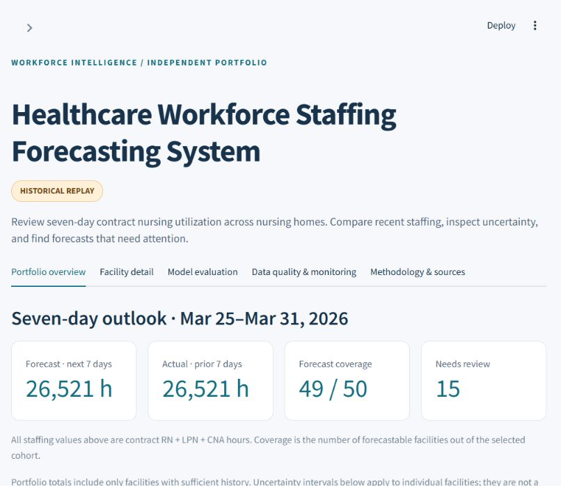
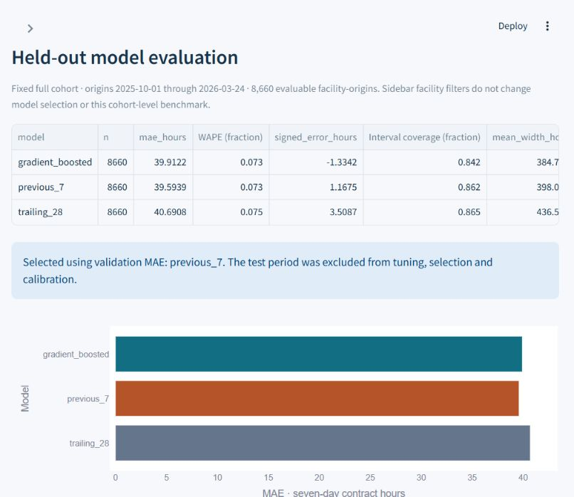
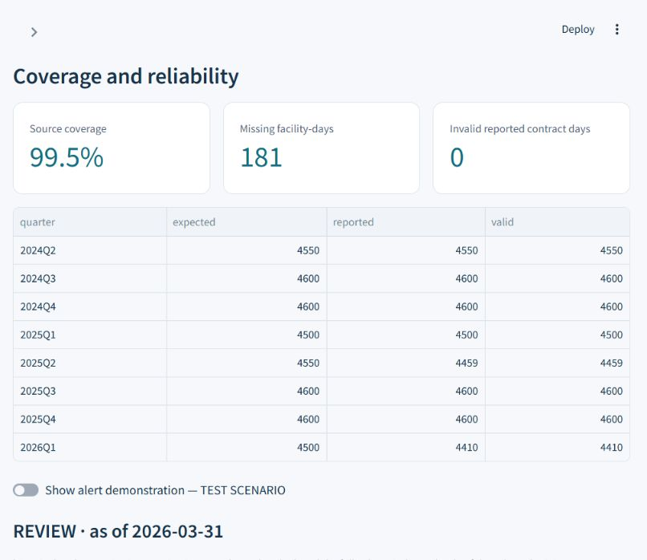

# Three-minute demonstration script

**Before speaking:** follow the [quick start](../README.md#quick-start--no-download-or-training-required), open the sidebar if collapsed, keep all three volume groups and **All matching facilities**, set the origin to **March 24, 2026**, and open the [executive brief](../artifacts/full/reports/EXECUTIVE_BRIEF.md). The bundled artifacts cover the full 50-facility analysis. All results are from the real-data historical replay. There is no public hosted application.

**0:00–0:25 — Business question.** “This asks how many contract RN, LPN and CNA hours a nursing home is likely to report over the next seven calendar days, and how uncertain that forecast is. It uses public CMS nursing-home staffing records. The yellow historical replay label matters: CMS releases quarterly, so daily arrival is an explicit simulation assumption.”

**0:25–0:55 — Portfolio review.** Show the forecast-origin control, next-seven-day hours, preceding-seven-day actuals, and facility count. “Facilities are chosen using early training history. I do not replace facilities based on later completeness. Here one facility has missing history, so its forecast is withheld.” Use the volume-group filter and download a forecast CSV.

**0:55–1:25 — One facility and uncertainty.** Open Facility detail and select a facility with positive contract utilization. Point to the interval and historical forecast/outcome plot. “Every point is a seven-day total. Orange actuals became known later and were never predictors. Wide intervals or poor historical coverage call for review. These hours do not tell us unmet demand or clinical staffing adequacy.”

**1:25–2:00 — Honest model comparison.** Open Model evaluation. “The preceding-seven-day baseline won chronological validation, so it stayed selected. On 8,660 held-out facility-origins it achieved 39.59 hours MAE and 7.29% WAPE; the gradient model was slightly weaker. Nominal 90% intervals covered 86.22%, which is undercoverage. I report that limitation rather than recalibrating on the test.” Show facility/volume metrics and representative failures.

**2:00–2:30 — Monitoring and reliability.** Open Data quality & monitoring. Show the real stale-history alert, then enable the labeled TEST SCENARIO. “This injected missing inputs, stale dates, drift and a failed job into copies. It did not alter the source, model or immutable forecasts. Alerts prompt investigation; they do not automatically retrain.”

**2:30–3:00 — Engineering and next steps.** “The installable Python package uses DuckDB SQL and Parquet, chronological training cutoffs, separate interval calibration, saved-model prediction, immutable forecast records and later outcome attachment. Tests cover leakage, target windows, persistence and the end-to-end path. Cloud Run, Cloud Storage and BigQuery deployment are prepared but not deployed. Prospective feed availability and facility-specific performance would be the next validation steps.”

## Screenshot walkthrough

These screenshots were captured from the actual application on September 13, 2026, with the default full-cohort replay. Displayed values were not edited. The sidebar is collapsed to keep the main view readable; use the top-left chevron to reopen it.

**Portfolio overview:** the March 25–31 outlook totals **26,521 hours** across **49 of 50** facilities with sufficient history. The sum equals the preceding week's hours because the selected method repeats that week. One facility is withheld; it is not silently replaced. The **15 needs-review** flags use retrospective test coverage and interval width, so they are review aids after evaluation, not historical-origin alerts.

**Model evaluation:** compare errors on the same held-out cohort. Table WAPE and interval coverage are displayed as fractions. The gradient model's MAE is 39.91 hours versus the selected baseline's 39.59. Both the validation decision and the untouched test are preserved. The nominal 90% interval covers only 86.22% of baseline outcomes. The [technical report](../artifacts/full/reports/BACKTEST.md) contains full precision, subgroup results and failure examples.

**Data quality & monitoring:** source coverage is 99.5%, with 181 missing facility-days and zero invalid reported contract days in the selected cohort. Scroll below the table for the real stale-facility alert at March 31. Turn on **Show alert demonstration — TEST SCENARIO** to see the four deliberately injected alert types, then switch it off. A simulation does not establish real operational monitoring performance.

For a concrete individual example, open **Facility detail**, select **335175 · Brookside Multicare Nursing Center**, and leave the origin at March 24. Its seven-day point forecast is **806.5 hours**. The shaded band is a facility interval; the orange line shows outcomes observed later. Each plotted point is a seven-day total, and daily-origin windows overlap. Return to **All matching facilities** before presenting the cohort benchmark.
