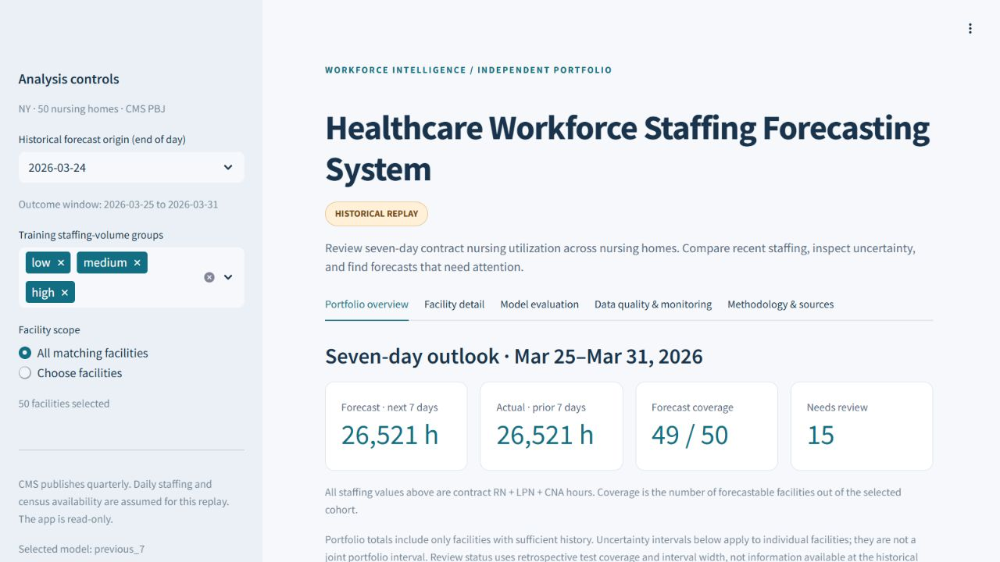
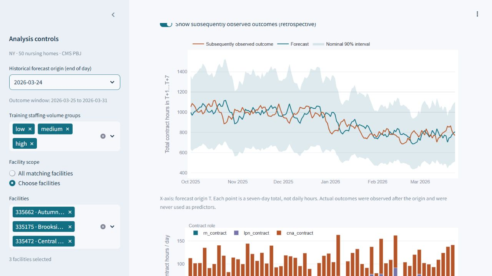

# Verified Google Cloud deployment

**Verified on September 13, 2026:** private versioned artifacts, BigQuery reconciliation, the public hosted dashboard, a successful historical batch, an idempotent repeat, and an observed controlled failure. This is hands-on GCP portfolio evidence using historical CMS data, not a live staffing system or enterprise production deployment.

**[Open the public dashboard](https://workforce-replay-260594395044.us-central1.run.app)** · [deployment instructions](GCP_DEPLOYMENT.md) · [learning guide](GCP_LEARNING_GUIDE.md) · [cleanup](GCP_CLEANUP.md)

## Deployed resources and identities

Project `workforce-replay-yv-260913`; region `us-central1`. Project billing is enabled. The authorized $5 usage budget covers September 13–October 13 and excludes credits from its cost calculation; thresholds are 50%, 80%, and 100%. Billing/payment identifiers, credit balances and personal account details are omitted from public evidence.

| Resource | Executed verification |
|---|---|
| Four private GCS buckets: `-wf-view`, `-wf-input`, `-wf-output`, `-wf-build` | Uniform access, public-access prevention, versioning and lifecycle verified. All 28 release objects were read back and checked. Anonymous artifact GET returned 403. Runtime reads succeeded; input/dashboard object generations remained unchanged. |
| BigQuery dataset `workforce_demo`, three versioned tables | DATE and STRING types checked, deterministic WRITE_EMPTY loads rerun without duplicates, integrity and all three model metrics reconciled. Tables expire 30 days after creation. |
| Cloud Build / Artifact Registry | Build `bd03bdeb-55d2-4f32-891a-f471fbe49094` succeeded, including container imports; regional `workforce/runtime` image stored. |
| Cloud Run service `workforce-replay` | Public access authorized and verified by anonymous HTTP 200 plus actual browser interaction. Revision `workforce-replay-00001-lcp`, min 0 / max 1, 1 CPU / 1 GiB, concurrency 10, 3,600-second timeout, session affinity. |
| Cloud Run job `workforce-replay-batch` | One task, 1 CPU / 1 GiB, 600-second normal task timeout, one retry, manually executed; no recurring schedule. |
| Cloud Logging | Read structured startup/success/failure events and platform exit codes from the deployed revision and executions. |

Both workloads use image digest `sha256:840702f92e799ff0db8144a1ceeaa18fbdefe079b6bd9fe3db35b02b0fc37a76`. [Build record](../cloud/evidence/build.json), [source archive inventory](../cloud/evidence/build-source.json), [service config](../cloud/evidence/service.json), [job config](../cloud/evidence/job.json), and [storage configuration/IAM/generations](../cloud/evidence/storage.json) preserve the concrete evidence. The source inventory matches the deployed application and original analytical files; subsequent documentation changes do not alter the running image.

The viewer account has objectViewer only on the dashboard bucket. The runner has objectViewer on inputs and objectViewer/objectCreator on outputs, with no delete or input-write grants. The builder reads the build bucket, writes the selected registry repository and writes logs. Neither runtime account has BigQuery privileges; the signed-in human deployer performed loading and SQL. [User-managed project-role extract](../cloud/evidence/runtime-project-roles.json) is separate from bucket and registry grants. Google-managed service agents and automatically created default accounts are not used as the workload identities.

## BigQuery results

| Table | Rows | Deterministic load job |
|---|---:|---|
| `daily_cms_ny50_v1` | 36,500 | `workforce_load_b428725507260fd34600cfab1e8a` |
| `forecasts_cms_ny50_v1` | 26,001 | `workforce_load_7d2fdc8b67a59791ec59ad92db48` |
| `outcomes_cms_ny50_v1` | 8,667 | `workforce_load_b370b31ace695a28b24ccb754da6` |

The integrity query found 36,500 daily grid rows, 36,319 reported days, 26,001 forecasts, 8,667 outcome rows and 8,660 known outcomes. All three duplicate-key counts and the unmatched-forecast count were zero. Reissuing the loader reused the completed load jobs and preserved these counts.

| Model | Issued | Evaluated | MAE hours | WAPE | Signed error hours | Interval coverage |
|---|---:|---:|---:|---:|---:|---:|
| gradient_boosted | 8,667 | 8,660 | 39.9122461957 | 7.3464589733% | -1.3341939013 | 84.1916859122% |
| previous_7 | 8,667 | 8,660 | 39.5939318707 | 7.2878683563% | +1.1674722864 | 86.2240184758% |
| trailing_28 | 8,667 | 8,660 | 40.6907667436 | 7.4897575799% | +3.5087378753 | 86.4549653580% |

The selected model remains `previous_7`. Seven issued forecasts per model lack known outcomes and are excluded from scoring, not replaced with zeros. All 15 floating metrics (including interval width) match the frozen local reports within relative tolerance 1e-9 / absolute tolerance 1e-8. The largest observed absolute difference was **1.14e-13**, consistent with distributed floating-point summation order. Integer counts match exactly.

- Integrity job: `workforce_integrity_a054d89f21264410`; dry run 4,471,550 bytes.
- Evaluation job: `workforce_evaluation_fc07d64290824f7f`; dry run 3,752,755 bytes.
- Both queries disabled cached results and set maximum bytes billed to 1,073,741,824. The initial evaluation dry run caught an unsupported BOOL-to-FLOAT64 cast; converting the interval indicator to INT64 resolved it before execution.

Evidence: [executed integrity SQL](../cloud/evidence/bigquery-integrity.sql), [integrity result](../cloud/evidence/bigquery-integrity.json), [executed evaluation SQL](../cloud/evidence/bigquery-evaluation.sql), [evaluation result and billing statistics](../cloud/evidence/bigquery-evaluation.json), [schema/load records](../cloud/evidence/bigquery-loads.json), [all metric differences](../cloud/evidence/bigquery-reconciliation.json).

## Actual hosted dashboard checks

The hosted page and health endpoint returned HTTP 200 without credentials. Its default origin was March 24, 2026, with 26,521 forecast hours and 49/50 facilities forecastable. The sidebar showed dataset `cms-ny50-c1b7f9939a74d3d1-v1` and model version `c1b7f9939a74d3d1`.

Selecting facilities 335662, 335175 and 335472 changed coverage to 3/3 and the displayed total to 806 hours. Changing the origin to October 1 changed the outcome window to October 2–8. Returning to March 24 and selecting Brookside (335175) showed 806.5 hours and a nominal interval of 511.8–1,101.2 hours. The forecast line, subsequently observed outcome line, interval band and role-level staffing chart rendered.

The forecast download had 50 unique facility rows: 49 numerical forecasts exactly reconciled with the frozen replay within numeric tolerance, plus facility 335668 labelled `Withheld — incomplete history` with a null prediction. The three-row evaluation CSV matched the saved metrics. The empty-selection message appeared after clearing facilities; the all-facilities state was then restored. [Hosted test record](../cloud/evidence/hosted-verification.json) · [empty-selection screenshot](../assets/gcp-empty-selection.png).

The `dashboard_artifacts_verified` startup event reports 17 verified files (16 data/report dependencies plus provenance) and `mount_read_only=true`. The mount flag was checked without attempting a write. IAM grants and unchanged GCS object generations provide additional evidence. The dashboard's held-out results remain read-only; the new job writes to its separate results bucket.

## Batch, repeat and failure

| Run | Cloud execution ID | Verified outcome |
|---|---|---|
| First success | `workforce-replay-batch-hts2t` | Completed; platform exit 0; `replay_success`; 49 issued and evaluated forecasts |
| Repeat | `workforce-replay-batch-2jvdc` | Completed; exit 0; same artifact ID; four pre-existing objects retained identical generations/checksums; only one new execution receipt |
| Missing-input test | `workforce-replay-batch-4xx6b` | Completed=False / failed task; both attempts logged `FileNotFoundError`; platform exit 1; no test output objects |

The bounded replay uses origin **2026-03-24** and as-of **2026-03-31**. Existing prediction code truncates observations at the origin before constructing features. Future actuals are attached only after predictions exist. No retraining or retuning occurred. The input manifest is pinned to `e92a44c60ade1871ca4e70889997d79f49b81b50b4a775fa7606bcca588d229a`.

Artifact ID `062681b80786c707cca1aed1` contains separate `predictions.parquet`, `actuals.parquet` and `report.json`. The report is the completion marker; execution receipts identify attempts. The 49 forecasts match the previously saved March 24 predictions. This one-origin subset has **40.24285714-hour MAE, 7.30056993% WAPE, -9.98163265-hour signed error and 85.71428571% coverage**; it is distinct from the full held-out benchmark.

The controlled test used execution-only overrides `INPUT_PREFIX=tests/intentionally-missing`, `OUTPUT_PREFIX=tests/missing-input`, and a 120-second task timeout. Its two attempts failed reading `job-input.json`, before prediction or output creation. The saved job configuration retains the original release and `runs` output prefix. It can be manually executed again after inspection.

Evidence: [execution states/configurations](../cloud/evidence/executions.json), [structured runtime events](../cloud/evidence/runtime-events.json), [platform exit records](../cloud/evidence/container-exits.json), [output checksums and result comparison](../cloud/evidence/job-output-verification.json), [retry generation comparison](../cloud/evidence/retry-verification.json).

## Resources retained, costs and learning

The public service remains deployed and scales to zero when idle. The job definition is retained with no active execution or schedule. Four buckets hold **35 current objects / 12,467,080 bytes** including two source archive copies, releases, results and receipts. The registry has one image (304,422,754 compressed image bytes reported by the API). Three BigQuery tables, three dedicated service accounts, logs and the project budget remain.

The build took approximately 3 minutes 22 seconds. Its list-price estimate at $0.006/minute is about $0.021; this is an estimate, not an invoice. Query evidence records actual processed/billed bytes. Final billed charges were not established during verification; billing reports and credits can lag. The light-use 30-day plan remains **$1–$3 estimated**, with **$5 authorized**, and no hard spending cap. An open dashboard WebSocket keeps compute active. Close demo tabs and review billing; remove resources by October 13 if ending the authorized demonstration. There is no automatic teardown. Follow [resource-specific cleanup](GCP_CLEANUP.md); do not delete the shared trial billing account or starter projects.

The [guided repeat query](../cloud/evidence/bigquery-evaluation.sql) was prepared in BigQuery Studio with a 1 GiB limit and caching disabled. The user could not locate the page during the guided step, so **user execution/understanding is not claimed**. The [learning guide](GCP_LEARNING_GUIDE.md) provides a short retry exercise and interview explanations. Automated cloud execution proves the recorded behavior, not the owner's mastery of every service.

The 39 original artifact hashes and all 52 original pipeline/artifact files remain unchanged; the original benchmark and Git history are preserved. Local cloud-contract tests and the earlier Linux container CI passed. Exhaustive load/accessibility testing, long-running reliability, enterprise security review, disaster recovery, prospective validation, clinical staffing adequacy and a live feed are outside this demonstration.

**Resume wording limited to completed work:** Deployed a historical healthcare forecasting portfolio on Google Cloud using private versioned Cloud Storage, BigQuery SQL reconciliation of 8,660 held-out forecasts, a public Cloud Run dashboard, and a repeat-safe batch job with structured success/failure logs.
